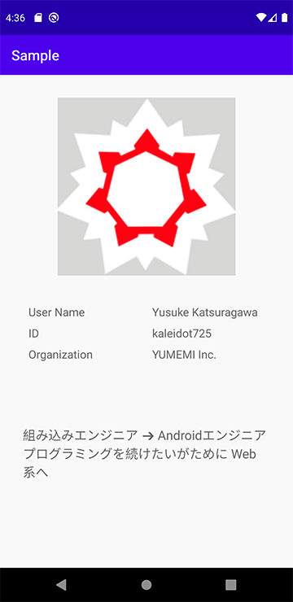
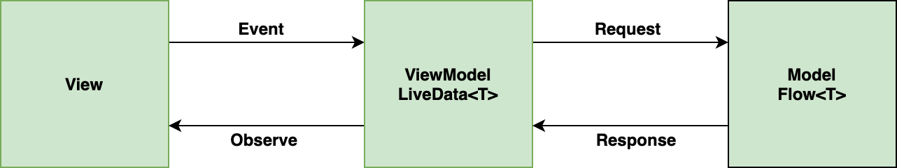

# 2020/03/14 ［Android］Flow と Retrofit を組み合わせたサンプルと解説

# はじめに

Flow と Retrofit を組み合わせたて次のサンプルを作成します。
アーキテクチャは Google が推奨している MVVM で作成を進めます。


| 作成するもの | アーキテクチャ |
| ------- | ------- |
|  |  |

# TL;DR

- Flow と Retrofit を連携するときは、戻り値が Flow となるように自分で実装する。
- Room から取得した Flow は `asLiveData` で LiveData に変換できる。
- Flow を LiveData に変換したあとは、通常の LiveData と同じで Observe して利用する。
- MVVM で `LiveData<T>` と `Flow<T>` を組み合わせるとこの構成になる。




# Setup

アプリケーションの作成に必要となる、
Koin・Retrofit・Flow・Coilのライブラリをインストールする。

| ライブラリ | バージョン | 説明 |
| ------- | ------- | ------- |
| Koin | 2.1.3 | DIライブラリ |
| Retrofit | 2.2.4 | HTTPクライアントライブラリ |
| Coroutines | 1.3.4 | 非同期処理やノンブロッキング処理を行うためライブラリ |
| Coil | 0.8.0 | 画像を読み込むためのライブラリ |

```groovy
dependencies {
    　　　︙  
    def koin_version = "2.1.3"
    implementation "org.koin:koin-android:$koin_version"
    implementation "org.koin:koin-android-scope:$koin_version"
    implementation "org.koin:koin-android-viewmodel:$koin_version"
    implementation "org.koin:koin-android-ext:$koin_version"

    def coroutines_version = "1.3.4"
    implementation "org.jetbrains.kotlinx:kotlinx-coroutines-core:$coroutines_version"

    def retrofit_version ="2.1.0"
    implementation "com.squareup.retrofit2:retrofit:$retrofit_version"
    implementation "com.squareup.retrofit2:converter-gson:$retrofit_version"

    def coil_version = "0.8.0"
    implementation "io.coil-kt:coil:$coil_version"
  
    def lifecycle_version = "2.2.0"
    implementation "androidx.lifecycle:lifecycle-viewmodel-ktx:$lifecycle_version"
    implementation "androidx.lifecycle:lifecycle-livedata-ktx:$lifecycle_version"
}
```

# Model
Retrofit を通して Qiita のユーザー情報を取得できるようにします。ユーザー情報は Qiita API の [GET /api/v2/users/:user_id](https://qiita.com/api/v2/docs#get-apiv2usersuser_id) を利用して取得します。次のクラスを作成し、Retrofit を通して Qiita API を利用できるようにします。

| 役割 | クラス名 | 役割 |
| ------- | ------- | -------- |
| Entity | User | Qiita API のユーザー情報を定義するクラス |
| Service | QiitaService | Qiita API を利用するためのサービスクラス |
| Repository | UserRepository | QiitaService を利用してデータを取得するクラス |


**User**

Qiita ユーザー情報を格納するためのデータクラスを定義する。

```kotlin
data class User(
    val description: String,
    val facebook_id: String,
    val followees_count: Int,
    val followers_count: Int,
    val github_login_name: String,
    val id: String,
    val items_count: Int,
    val linkedin_id: String,
    val location: String,
    val name: String,
    val organization: String,
    val permanent_id: Int,
    val profile_image_url: String,
    val team_only: Boolean,
    val twitter_screen_name: String,
    val website_url: String
)
```


**QiitaService**

Retrofit で Qiita API の [GET /api/v2/users/:user_id](https://qiita.com/api/v2/docs#get-apiv2usersuser_id) を利用できるようにする。詳しくは Retrofit の[公式ドキュメント](https://square.github.io/retrofit/) を閲覧してください。

```Kotlin
interface QiitaService {
    @GET("/api/v2/users/{user_id}")
    fun getUser(@Path("user_id") user_id: String): Call<User>
}
```

**UserRepository**

QiitaService から取得した `Call<User>` を UserRepository で `Flow<User>` に変換する。こんな感じで ViewModel からデータ取得をリクエストする際には、`Call<User>` ではなく `Flow<User>` を通して行うようにしてやる。

```Kotlin
class UserRepository(private val service: QiitaService) {
    fun getUser(userId: String): Flow<User> {
        return flow {
            try {
                emit(service.getUser(userId).execute().body())
            } catch (e: Exception) {
                Log.e("UserRepository", "getUser error", e)
                emit(nullUser)
            }
        }.flowOn(Dispatchers.IO)
    }
}
```

# ViewModel

ViewModel では Model から取得した `Flow<T>` を `LiveData<T>` に変換し、 View が `LiveData<T>` を購読してデータを表示できるようにしておきます。`Flow<T>` は `asLiveData()` で `LiveData<T>` に変換できるので、`asLiveData()` を利用して変換してやります。

```Kotlin
class MainViewModel(private val userRepository: UserRepository): ViewModel() {
    val user: LiveData<User> = userRepository.getUser("kaleidot725").asLiveData()
}
```

# View

**Koin**

作成してきた ViewModel と Model を生成するため　Koin の AppModule を定義する。
次の定義で QiitaService・UserRepository・MainViewModel を生成できるようにする。

```Kotlin
val appModule = module {
    single {
        Retrofit.Builder()
            .baseUrl("https://qiita.com/")
            .addConverterFactory(GsonConverterFactory.create())
            .build()
    }

    single {
        get<Retrofit>().create(QiitaService::class.java)
    }

    single {
        UserRepository(get())
    }

    viewModel {
        MainViewModel(get())
    }
}
```

**MainActivity**

ここまで定義できれば、あとは MainActivity で View を更新する処理を記述すれば完成です。
MainViewModel の `LiveData<T>` を `observe` し、データ取得が完了したら View が更新されるようにします。

```Kotlin
class MainActivity : AppCompatActivity() {
    private val viewModel : MainViewModel by viewModel()

    override fun onCreate(savedInstanceState: Bundle?) {
        super.onCreate(savedInstanceState)
        setContentView(R.layout.activity_main)

        startKoin {
            androidLogger()
            androidContext(applicationContext)
            modules(appModule)
        }

        val binding : ActivityMainBinding = 
           DataBindingUtil.setContentView(this, R.layout.activity_main)
        binding.viewModel = viewModel

        viewModel.user.observe(this, Observer {
            binding.userImageView.load(it.profile_image_url)
            binding.userNameValue.text = it.name
            binding.idValue.text = it.id
            binding.organizationValue.text = it.organization
            binding.descriptionValue.text = it.description
        })
    }
}
```

```xml
<?xml version="1.0" encoding="utf-8"?>

<layout>

    <data>

        <variable
            name="viewModel"
            type="kaleidot725.sample.ui.MainViewModel" />
    </data>

    <androidx.constraintlayout.widget.ConstraintLayout 
        xmlns:android="http://schemas.android.com/apk/res/android"
        xmlns:app="http://schemas.android.com/apk/res-auto"
        xmlns:tools="http://schemas.android.com/tools"
        android:layout_width="match_parent"
        android:layout_height="match_parent"
        tools:context=".ui.MainActivity">

        <ImageView
            android:id="@+id/user_image_view"
            android:layout_width="250dp"
            android:layout_height="250dp"
            android:layout_marginTop="32dp"
            android:background="@android:color/black"
            app:layout_constraintEnd_toEndOf="parent"
            app:layout_constraintStart_toStartOf="parent"
            app:layout_constraintTop_toTopOf="parent" />

        <androidx.constraintlayout.widget.ConstraintLayout
            android:layout_width="match_parent"
            android:layout_height="0dp"
            android:layout_margin="32dp"
            app:layout_constraintBottom_toBottomOf="parent"
            app:layout_constraintEnd_toEndOf="parent"
            app:layout_constraintStart_toStartOf="parent"
            app:layout_constraintTop_toBottomOf="@id/user_image_view">

            <TextView
                android:id="@+id/user_name_title"
                android:layout_width="0dp"
                android:layout_height="wrap_content"
                android:layout_margin="8dp"
                android:text="User Name"
                android:textSize="16sp"
                app:layout_constraintEnd_toStartOf="@id/user_name_value"
                app:layout_constraintStart_toStartOf="parent"
                app:layout_constraintTop_toTopOf="parent"
                tools:text="User Name" />


            <TextView
                android:id="@+id/user_name_value"
                android:layout_width="0dp"
                android:layout_height="wrap_content"
                android:layout_margin="8dp"
                android:textSize="16sp"
                app:layout_constraintEnd_toEndOf="parent"
                app:layout_constraintStart_toEndOf="@id/user_name_title"
                app:layout_constraintTop_toTopOf="parent"
                tools:text="Yusuke Katsuragawa" />

            <TextView
                android:id="@+id/id_title"
                android:layout_width="0dp"
                android:layout_height="wrap_content"
                android:layout_margin="8dp"
                android:text="ID"
                android:textSize="16sp"
                app:layout_constraintEnd_toStartOf="@id/id_value"
                app:layout_constraintStart_toStartOf="parent"
                app:layout_constraintTop_toBottomOf="@id/user_name_title"
                tools:text="ID" />


            <TextView
                android:id="@+id/id_value"
                android:layout_width="0dp"
                android:layout_height="wrap_content"
                android:layout_margin="8dp"
                android:textSize="16sp"
                app:layout_constraintEnd_toEndOf="parent"
                app:layout_constraintStart_toEndOf="@id/id_title"
                app:layout_constraintTop_toBottomOf="@id/user_name_value"
                tools:text="ID" />

            <TextView
                android:id="@+id/organization_title"
                android:layout_width="0dp"
                android:layout_height="wrap_content"
                android:layout_margin="8dp"
                android:text="Organization"
                android:textSize="16sp"
                app:layout_constraintEnd_toStartOf="@id/organization_value"
                app:layout_constraintStart_toStartOf="parent"
                app:layout_constraintTop_toBottomOf="@id/id_title"
                tools:text="Organization" />


            <TextView
                android:id="@+id/organization_value"
                android:layout_width="0dp"
                android:layout_height="wrap_content"
                android:layout_margin="8dp"
                android:textSize="16sp"
                app:layout_constraintEnd_toEndOf="parent"
                app:layout_constraintStart_toEndOf="@id/organization_title"
                app:layout_constraintTop_toBottomOf="@id/id_value"
                tools:text="Company Name" />

            <TextView
                android:id="@+id/description_value"
                android:layout_width="wrap_content"
                android:layout_height="wrap_content"
                android:layout_margin="32dp"
                android:textSize="18sp"
                app:layout_constraintTop_toBottomOf="@id/organization_title"
                app:layout_constraintStart_toStartOf="parent"
                app:layout_constraintEnd_toEndOf="parent"
                app:layout_constraintBottom_toBottomOf="parent"
                tools:text="Description" />

        </androidx.constraintlayout.widget.ConstraintLayout>

    </androidx.constraintlayout.widget.ConstraintLayout>
</layout>
```

# おわり
アプリケーションは Model  `Flow<T>` を生成、 ViewModel で `LiveData<T>` を生成、そして View で `LiveData<T>` を observe してデータ更新という構成で実装しました。Room だと Room 側で `Flow<T>` に変換してくれるのですが、Retrofit では対応していなそうなので自身で `Flow<T>` に変換しなくてはならないみたいですね。


エラー処理を考慮するとまた印象が変わるかもしれませんが、`LiveData<T>` と `Flow<T>` を組み合わせたパターンはとても実装しやすいですね。今後は `LiveData<T>` と `Flow<T>` の組み合わせが主流になるんではないでしょうか。今回作成したサンプルは次に保存してありますので興味があれば閲覧お願いします。

<a href="https://github.com/kaleidot725-android/kotlin_flow_and_retrofit"></a>
